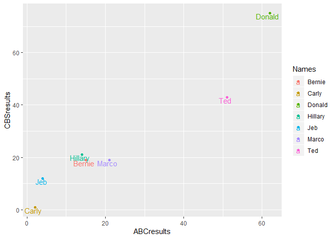

R Programming Module 3 - Dataframe
================

"The data set below is based on the presidential election during 2016, where it outlined the name of the candidate, the source of the poll (ABC vs, CBS). Discuss your result in your blog. Important note, I made up this data, so this data does not reflect what really happened in the election."

``` r
Names = c("Jeb", "Donald", "Ted", "Marco", "Carly", "Hillary", "Bernie")

ABCresults = c(4, 62, 51, 21, 2, 14, 15)

CBSresults = c(12, 75, 43, 19, 1, 21, 19)

df = data.frame(Names, ABCresults, CBSresults)
```

Quick visualization after creating the dataframe from our vectors.

``` r
ggplot(df, aes(ABCresults, CBSresults, color = Names)) + geom_point() + 
    geom_text(aes(label = Names), check_overlap = FALSE, hjust = 0.6, vjust = 1)
```


